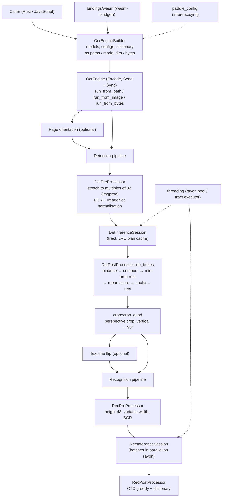

# Architecture: Pure Rust OnnxOCR

Author: Shion Watanabe  
First version: 2025-11-09  
Revised: 2026-10-03 (v0.2.0: PP-OCRv6, PaddleOCR 3.x compatibility, WebAssembly, multi-threading)  
Repository: http://github.com/siska-tech/pure-onnx-ocr

## Purpose

- Describe the module structure. `OcrEngine` sits at the centre and coordinates three independent pipelines:
  - detection (preprocess → inference → post-process);
  - recognition (crop → preprocess → inference → CTC decode);
  - optional orientation classifiers (page and text line).
- Make responsibilities explicit. `OcrEngine` controls the flow, detection produces 4-point text boxes, and recognition turns crops into text. ONNX loading, `inference.yml` parsing, resampling and thread pools each live in their own module.
- Fix the design principles: separation of concerns, a Facade (`OcrEngine`) and a Builder (`OcrEngineBuilder`). Pre- and post-processing **reproduce PaddleOCR 3.x (PaddleX)**, which `tests/paddle_parity.rs` verifies.

## 1. Component diagram

## 2. Module relationships

### 2.1 Data flow

1. **Input**: a path, a `DynamicImage` or encoded image bytes.
2. **Page orientation** (optional): the page is classified as rotated by 0/90/180/270° and turned upright. Result coordinates are mapped back at the end.
3. **Detection**:
   1. The scale comes from the long-side cap (default 960) or the short-side minimum (PaddleOCR's setting).
   2. Each side is **stretched** to the nearest multiple of 32 with OpenCV-compatible bilinear resampling.
   3. The image is converted to a BGR, ImageNet-normalised NCHW tensor.
   4. DBNet produces the probability map.
   5. `db_boxes` turns it into rectangles and scores exactly like PaddleOCR's `DBPostProcess`.
   6. The rectangles are scaled back to the input image per axis.
4. **Crop**: each rectangle is perspective-warped with bicubic interpolation. Crops with height/width ≥ 1.5 are rotated 90° counter-clockwise.
5. **Text-line flip** (optional): crops predicted upside down are rotated 180°.
6. **Recognition**: crops are sorted by aspect ratio and split into batches of `rec_batch_size` (default 1). Each batch is resized to height 48 with a variable width and normalised. Batches are inferred and decoded in parallel on the thread pool.
7. **Output**: `Vec<OcrResult { text, confidence, bounding_box }>`. The `run_with_metrics_*` variants also return stage timings and the page angle.

### 2.2 Main sequence (`OcrEngine::run_from_path`)

1. `OcrEngineBuilder::…build()` parses `inference.yml`, loads the ONNX models (discarding `value_info` shape hints), builds the dictionary and creates the thread pool.
2. `run_from_path` decodes the image.
3. Optional page orientation classification.
4. Detection: preprocess, then inference (one compiled plan per input shape), then `db_boxes`, then rescaling.
5. Crop and optional text-line flip.
6. Recognition: preprocess, inference and decode, each stage parallel over batches.
7. Return the results.

## 3. Design principles

- **Separation of concerns**: Pure Rust crates and in-house modules replace the C/C++ stack (see section 4).
- **Encapsulation and Facade**: `OcrEngine` owns models, dictionary, configuration, thread pool and plan caches. Callers only call `run_*`.
- **Builder**: `OcrEngineBuilder` combines input sources (paths, PaddleOCR model directories, bytes) with parameters.
- **PaddleOCR parity**: pre- and post-processing mirror PaddleX. `tests/reference/*.json` (PaddleOCR 3.7 outputs) catch regressions.
- **Thread safety**: plan caches are behind a `Mutex`, so `OcrEngine` is `Send + Sync`. Batches running in parallel execute tract single-threaded, because tract keeps per-thread scratch space in a `RefCell`, and nested rayon work stealing would borrow it twice.

## 4. Technology choices

| Area | Choice | Notes |
| :--- | :--- | :--- |
| ONNX inference | `tract-onnx` 0.23 | Pure Rust; 0.20 cannot run PP-OCRv6 medium |
| Parallelism | `rayon` + `tract-linalg/multithread-mm` | Parallel recognition batches (up to 8 threads by default), feature `multithread` |
| N-d arrays | `ndarray` 0.17 | Same version as tract |
| Image I/O | `image` | Decoding and cropping |
| Resampling | in-house `imgproc` | Identical to `cv2.resize(INTER_LINEAR)` |
| Contours / perspective warp | `imageproc` | Replaces `cv2.findContours` and `cv2.warpPerspective` |
| Polygon offset | `i_overlay` | Replaces `pyclipper` (round joins) |
| Geometry | `geo-types` | Type of `OcrResult::bounding_box` |
| YAML | in-house `paddle_config` | The PyYAML block subset only, no dependency |
| Logging | `log` | The caller decides where logs go |
| WebAssembly | `wasm-bindgen` (`bindings/wasm`), `web-time`, `getrandom/wasm_js` | Browsers, with SIMD128 enabled |
